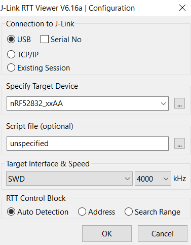

# Getting started with Wisol SFM20Rx EVK SDK and gcc

## Introduction

The purpose of this tutorial is to help you getting started with Wisol quad-mode module SFM20Rx, especially how-to setup their SDK with gcc.

__SFM20Rx__ is a multi-mode module including __Sigfox__ connectivity, __WiFi__, __BLE__ and __GPS__ and multiple sensors (magnetic, temperature, accelerometer). The EVK also comes with an NFC tag.
The main core of the module is based on the Nordic nRF52832 SOC. Wisol has developed an application layer on top of Nordic SDK to interact with all connectivity blocks and sensors. BLE can be directly programmed using Nordic SDK directives as it is embedded into the nRF52 chip.

# Keil development environment (windows)
##@ [Development_Environment_Setup_Guide](development/sigfox_cfg2/documentation/manual/[WISOL]Development_Environment_Setup_Guide_V202.pdf)

# GCC development environment (linux or mac)
### Prerequisites

- __Hardware__
  - Wisol SFM20Rx evaluation board
  - JLink/SWD cable
  - nRF52 DK board: optional, used as a master to connect to the Wisol dev kit using SWD. Can be bypassed if you own JTAG/SWD debugger probe.

- __Software__
  - __MinGW__ and __MSys__: Windows users only (http://www.mingw.org/). Provides open-source GNU tools required to use the Makefiles. Don't use Cygwin as there are incompatibilities. (test by git bash for windows64, mingw64-make)
  - __J-Link software__ for debugging (https://www.segger.com/downloads/jlink/)
  - __nrfutil__: for Linux/macOS only. If you have python and pip already installed, just run the following command:
```
pip install nrfutil
```
For more information, see the link https://github.com/NordicSemiconductor/pc-nrfutil


### Architecture of the SDK

The Wisol SDK is based on top of Nordic nRF5x SDK (based on v12.1 as of today). You will find the regular Nordic directories:
- components
- documentation
- examples
- external
- svd

In addition to them, Wisol SDK has been created into the __development/sigfox_cfg2__ directory, including the following:
- binary: Nordic softdevice including BLE stack with DFU over-the-air
- documentation: Wisol manuals and application notes
- source_bootloader_secure: source code for the bootloader (already flashed on the module)
- source_xxx_example: different examples to use gps, sensors, wifi and sigfox
- source_simplework_example: this is a more complete example. The application starts by broadcasting a BLE beacon. Then it scans WiFi band and sends BSSID with highest RSSI using Sigfox. Afterwards, if a GPS location has been detected it is also sent using Sigfox. This process is repeated every 10 minutes by default.

Keil projects are embedded into the SDK. We have added additional Makefiles to the different examples in order to compile with gcc.

### Flashing the module

Wisol SDK includes Nordic tools and gcc-arm to compile and flash the code for Windows. Linux/macOS version has been added in *tools/sfxtools_embedded*.


Go into the example directory to be flashed, ie source_sigfox_example:

Linux/macOS users
```
cd development/sigfox_cfg2/source/
make
```

mingw64 users
```
cd development/sigfox_cfg2/source/s132/armgcc
make
```

To flash the device via JLink/SWD:
```
make flash
or
make flashall
```

### How to flash the application via DFU

[](https://youtu.be/YftrZyONju8)

### Debugging via JLink/SWD

To debug messages via SWD link, J-Link software must be installed first.
For Windows, starts the program J-Link RTT Viewer with following parameters



Once connected, debug messages will be displayed in the terminal window.

The debug messages are printed with the function ```cPrintLog()```


For Linux/macOS users, a shell script can directly be launched:
```
cd tools/scripts/
./JLinkRTT.sh
```